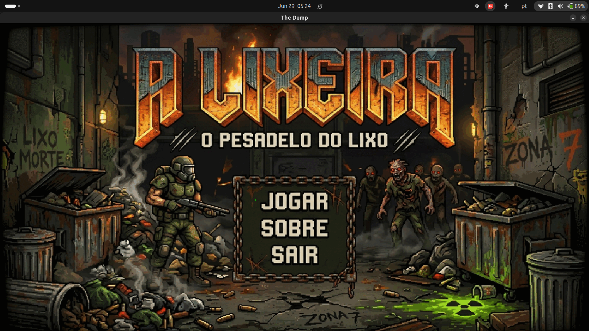
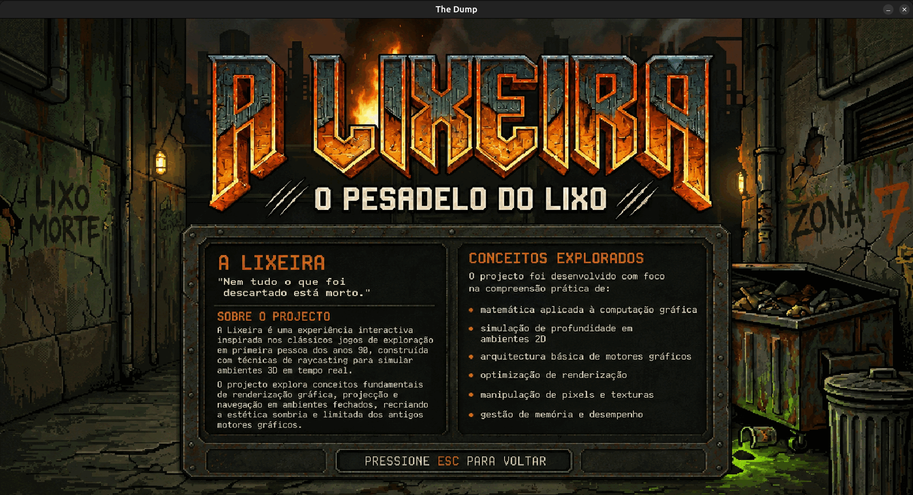
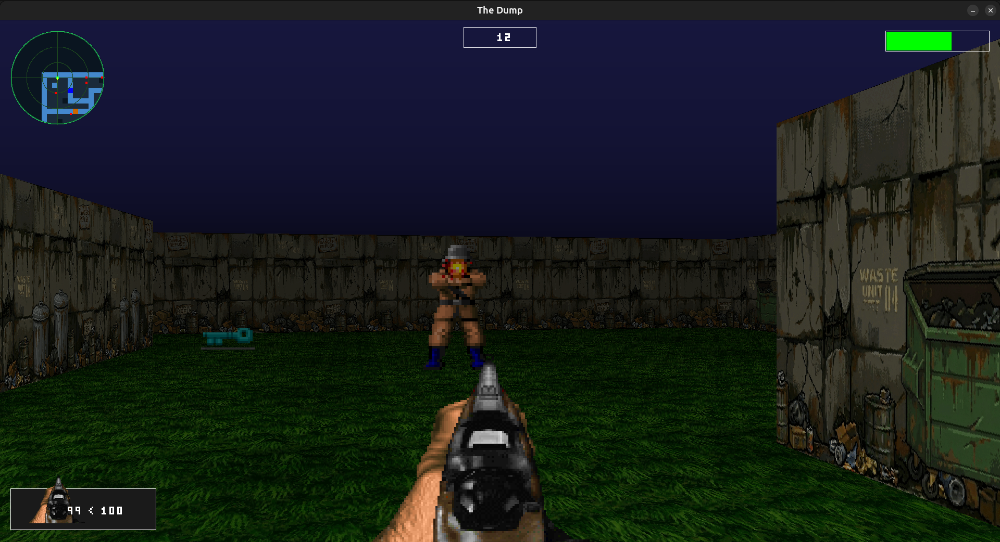
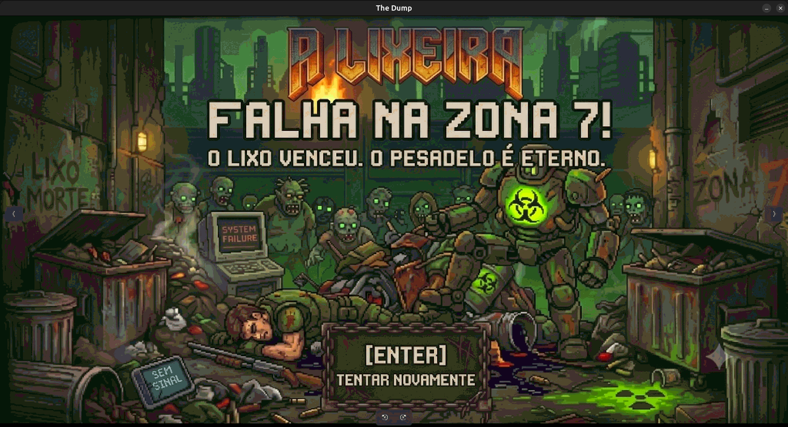
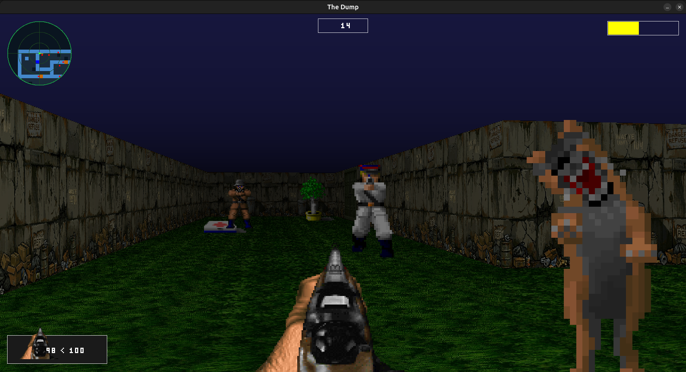
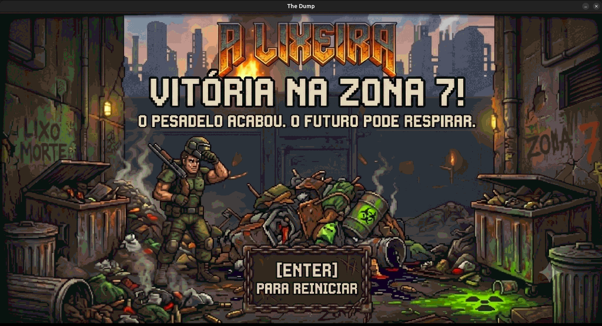

# The Dump - O Pesadelo do Lixo

Este é um jogo em primeira pessoa com perspectiva 3D retro, construído inteiramente em linguagem C. O motor gráfico foi desenvolvido do zero utilizando o algoritmo de **Raycasting** (semelhante aos clássicos Wolfenstein 3D e Doom) com suporte ao algoritmo **DDA (Digital Differential Analysis)** para a detecção precisa de colisões com paredes e projeção tridimensional de portas e sprites.

O jogo também possui renderização paralela com threads para máxima performance, animações fluidas de armas e inimigos, áudio integrado via biblioteca BASS e um sistema completo de movimentação, colisão e inteligência artificial para os inimigos.

---

## 🚀 Requisitos do Sistema

Para rodar este projeto, você precisará de um sistema **Linux** (o motor foi projetado com dependências específicas do X11) e das seguintes dependências de desenvolvimento:

*   **Compilador GCC / Clang**
*   **GNU Make**
*   **X11 / Xlib Development Libraries** (necessários para a MiniLibX)
    *   No Debian/Ubuntu e derivados, instale usando:
        ```bash
        sudo apt-get update
        sudo apt-get install make clang libx11-dev libxext-dev
        ```
*   **Biblioteca de Áudio BASS** (já inclusa no repositório na pasta `bass/`)

---

## 🛠️ Como Baixar, Compilar e Jogar

1.  **Clonar o repositório** (ou baixar os arquivos do projeto).
2.  **Compilar o projeto**:
    No diretório raiz do projeto, execute o comando:
    ```bash
    make
    ```
    Isso compilará as bibliotecas internas (`libft`, `minilibx`) e gerará o executável `thedump`.
3.  **Executar o jogo**:
    Execute o executável gerado:
    ```bash
    ./thedump
    ```
    *Nota: Se quiser rodar o jogo especificando um mapa personalizado diretamente, você pode passar o caminho dele como argumento:*
    ```bash
    ./thedump maps/level2.cub
    ```
4.  **Limpar arquivos de compilação** (opcional):
    ```bash
    make clean   # Remove os arquivos objeto (.o)
    make fclean  # Remove os objetos e o executável final
    ```

---

## 🎮 Controles do Jogo

*   **Movimentação:** `W` (frente), `S` (trás), `A` (esquerda), `D` (direita)
*   **Olhar/Câmera:** Movimento do Mouse (ou setas direcionais se preferir)
*   **Interagir (Portas):** `Espaço` (Space)
*   **Atirar:** Botão Esquerdo do Mouse ou `Enter` / `Ctrl Direito` (RCTRL)
*   **Selecionar Armas:**
    *   `1`: Revólver (WEAPON_REVOLVER)
    *   `2`: Gatling/Plasma (WEAPON_PLASMA)
    *   `3`: Rifle de Ferrolho (WEAPON_RIFLE)
*   **Pausar / Menu:** `ESC` (abre o menu do jogo, pausa a música e congela a partida)
*   **Mapa Tático (Minimapa ampliado):** `U` (alterna o modo de mapa tático completo)
*   **Mira:** `M` (liga/desliga a mira na tela)

---

## 🗺️ Como Criar e Customizar Mapas

Os mapas do jogo são definidos em arquivos com a extensão `.cub`. Eles contêm as definições de texturas, cores e a grade estrutural do nível.

### Estrutura de um arquivo `.cub`

O arquivo é dividido em duas seções: as configurações de texturas/cores e a grade do mapa.

#### 1. Configurações de Textura e Cor
*   `NO [caminho]`: Textura da parede voltada ao Norte.
*   `SO [caminho]`: Textura da parede voltada ao Sul.
*   `WE [caminho]`: Textura da parede voltada ao Oeste.
*   `EA [caminho]`: Textura da parede voltada ao Leste.
*   `F [caminho ou RGB]`: Textura (caminho .xpm) ou Cor do Chão (formato `R,G,B`).
*   `C [caminho ou RGB]`: Textura (caminho .xpm) ou Cor do Teto (formato `R,G,B`).

Exemplo:
```text
NO ./assets/theme/parede4.xpm
SO ./assets/theme/parede4.xpm
WE ./assets/theme/parede2.xpm
EA ./assets/theme/parede1.xpm
F ./assets/theme/grama1.xpm
C 30,30,80
```

#### 2. Grade do Mapa (Grid)
A grade representa o design físico do nível. O mapa **deve ser totalmente fechado** por paredes (`1`).

Significado de cada caractere na grade:
*   `1`: **Parede** (Wall) - Obstáculo intransponível.
*   `0`: **Chão Vazio** (Floor) - Espaço caminhável.
*   `N` / `S` / `E` / `W`: **Posição Inicial do Jogador** e a direção em que ele começará olhando (Norte, Sul, Leste, Oeste).
*   `D`: **Porta Normal** - Abre ao pressionar `Espaço` na frente dela.
*   `L`: **Porta Trancada** - Requer a Chave Azul (`K`) para abrir na primeira vez. Depois de aberta, destranca permanentemente.

##### Itens Coletáveis e Interativos:
*   `K`: **Chave Azul** - Item necessário para abrir portas trancadas (`L`).
*   `H`: **Kit Médico** - Cura 50 pontos de vida (HP) e recarrega a reserva de munição de todas as armas.
*   `P`: **Poço de Água** - Cura 100 pontos de vida (HP) ao ser coletado.
*   `G`: **Planta Dourada** - Concede o Buff de **Invencibilidade** (Gold Buff) por 10 segundos. O HP fica protegido de tiros e explosões.
*   `B`: **Barril Explosivo** - Obstáculo físico interativo. Se for atingido por um tiro, explode causando dano devastador a todos os inimigos e ao jogador na área de explosão (a menos que o jogador esteja com o Buff de Invencibilidade).

##### Inimigos:
*   `M`: **Soldado** - Inimigo padrão com ataque de curta/média distância.
*   `U`: **Oficial** - Inimigo mais rápido e resistente que o soldado, com tiros à distância.
*   `Z`: **Cachorro** - Inimigo veloz que avança diretamente para realizar ataques corpo a corpo rápidos.
*   `X`: **Chefe (Boss)** - Um inimigo extremamente resistente com alto dano. Aparece nos níveis finais.

---

## 🏆 Como Vencer o Jogo

O jogo possui uma campanha linear com três fases:
1.  `maps/level1.cub` (Fase Inicial)
2.  `maps/level2.cub` (Fase Avançada)
3.  `maps/boss.cub` (Frente a frente com o Chefe)

*   **Objetivo de cada nível comum:** Para liberar a transição para a próxima fase, você deve **eliminar todos os inimigos** presentes no mapa. Assim que o último inimigo morrer, o portal ou tela de transição se tornará ativo.
*   **Objetivo do nível do Chefe:** Você deve derrotar o **Chefe (`X`)** para vencer o jogo de forma definitiva e alcançar a tela de Vitória (`VICTORY`).

---

## 🖼️ Capturas de Tela (Screenshots)

Confira a atmosfera retro em primeira pessoa do jogo:

### Menu Principal


### Jogabilidade Geral & HUD


### Combates Intensos


### Portas e Exploração


### Inventário & Minimapa Tático


### Combate de Curto Alcance

